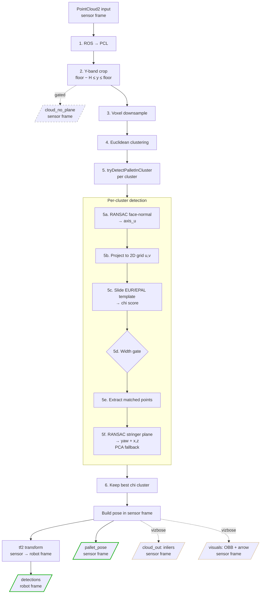

# Pallet Detection Pipeline

End-to-end flow of the `pallet_perceptor` node — from incoming point cloud to published detection.

## Pipeline

**Legend:**
- Green = always published on every detection
- Dashed grey = subscriber-gated (only serialized if someone is listening)
- Dashed orange = `vizbose__` debug-only

## Published Topics

| Topic | Type | When | Frame |
|---|---|---|---|
| `detections` | `target_detector/Detections` | every detection | robot |
| `pallet_pose` | `geometry_msgs/PoseStamped` | every detection | sensor |
| `cloud_no_plane` | `sensor_msgs/PointCloud2` | subscriber-gated | sensor |
| `cloud_out` | `sensor_msgs/PointCloud2` | `vizbose` only | sensor |
| `visuals` | `visualization_msgs/Marker` (OBB + arrow) | `vizbose` only | sensor |

## Why these stages?

| Stage | Purpose |
|---|---|
| **Y-band crop** | Sole spatial filter. Replaces a separate XYZ ROI box: the camera is mounted at a fixed, known height, so `floor_y` is a constant and anything outside the pallet height band cannot be the pallet. Dropping outside-band points up-front shrinks the work for every later stage. |
| **Voxel downsample** | Reduce point density before clustering and per-point work. |
| **Euclidean clustering** | Isolate individual candidate objects in the band. |
| **Face-normal RANSAC (5a)** | Find the pallet face direction so the 2D projection follows the true face, not camera X. Makes detection yaw-aware up to ~25°. |
| **Template matching (5b–5c)** | Recognize the EUR/EPAL fork-pocket pattern (top deck + 3 stringers). |
| **Width gate (5d)** | Rejects matches whose width doesn't fit the expected pallet dimensions. |
| **Stringer-zone RANSAC (5f)** | Refine yaw and (x, z) using only stringer points — excludes any box on the top deck that could bias the fit. |
| **TF to robot frame** | Downstream consumers (navigation, manipulation) expect robot-relative coordinates. |
