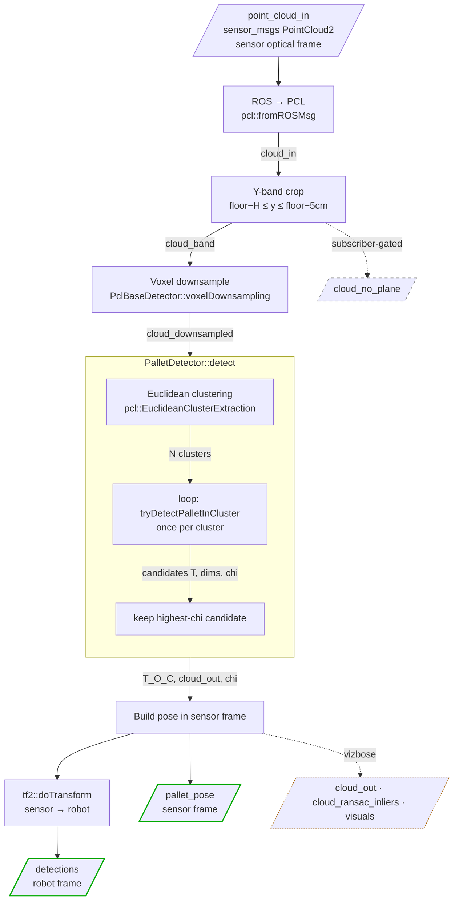

# Pallet Detection Pipeline

End-to-end flow from the incoming point cloud to the published pallet pose.

The code is split in two classes:

- **`PalletPerceptor`** (`pallet_perceptor.cpp`) — the ROS node. Handles subscriptions,
  TF, the sensor-frame preprocessing (Y-band crop + voxel downsample) and all publishing.
- **`Detectors::PalletDetector`** (`detectors/pallet_detector.cpp`) — the algorithm. Takes a
  preprocessed cloud, does Euclidean clustering and the full per-cluster detection,
  returns the best pallet pose. No ROS dependencies.

---

## 1. Top-level pipeline



**Preprocessing (in `PalletPerceptor`), stage by stage:**

| Stage | Method | Input | Output |
|---|---|---|---|
| ROS → PCL | `pcl::fromROSMsg` | `point_cloud_in` (`PointCloud2`) | `cloud_in` (PCL cloud, sensor frame) |
| Y-band crop | inline loop on `pt.y` | `cloud_in` | `cloud_band` — only points in the pallet height band; also published on `cloud_no_plane` |
| Voxel downsample | `PclBaseDetector::voxelDownsampling` | `cloud_band` | `cloud_downsampled` — density-reduced cloud handed to the detector |

---

## 2. Detection pipeline (`PalletDetector::detect`, after Euclidean clustering)

```mermaid
graph TD
    IN[cluster<br/>raw points of one Euclidean cluster] --> S1[Statistical Outlier Removal<br/>pcl::StatisticalOutlierRemoval]
    S1 -->|cluster_clean| S2[Pre-RANSAC: face normal<br/>estimateFaceNormalAxisU]
    S2 -. rejected .-> X[&#10007; drop cluster]
    S2 -->|axis_u| S3[Project to 2D grid<br/>projectToFaceGrid]
    S3 -->|occupancy grid u,v| S4[Slide EUR/EPAL template<br/>slideTemplate]
    S4 -->|chi + matched window| S5{Width gate}
    S5 -. fail .-> X
    S5 -->|matched window| S6[Extract matched_pts<br/>points inside the window]
    S6 -->|matched_pts| S7[Pose-RANSAC: stringer plane<br/>computePalletPose]
    S7 -. fail .-> X
    S7 -->|yaw, x, z, ransac_inliers| S8{Yaw consistency check<br/>pre_yaw vs pose yaw &le; 8&deg;}
    S8 -. fail .-> X
    S8 --> S9[Build T_object_in_sensor<br/>+ OBB dims + RANSAC-inlier OBB]
    S9 --> OK[&#10003; candidate:<br/>T, dims, matched_pts, ransac_inliers, chi]
```



The `detect()` method runs this per-cluster pipeline on every cluster and keeps the
candidate with the highest `chi` score. Any cluster that hits a `✗ drop cluster` exit is
silently discarded — if every cluster is dropped, `detect()` returns `false` and the
perceptor logs `No pallet detected`.

---

## 3. Detection stages explained (post Euclidean clustering)

### Statistical Outlier Removal (SOR)

Cleans the raw cluster before any geometry is fit to it.

```
cluster (one cluster from Euclidean clustering)
    ↓ pcl::StatisticalOutlierRemoval  (K = 15 neighbours, threshold = 1.5 σ)
cluster_clean   ← every later stage in the cluster pipeline reads from here
```

- **Input:** `cluster` — the raw points of a single Euclidean cluster.
- **Function:** `tryDetectPalletInCluster()`, SOR block.
- **PCL logic:** for each point, compute the mean distance to its K = 15 nearest neighbours; drop any point whose mean distance is more than 1.5 σ above the cluster average.
- **Purpose:** depth-camera noise scatters stray points along the camera ray. Those outliers would pull the RANSAC plane fits off-axis. Removing them keeps the dense face points and discards the isolated noise.
- **Output:** `cluster_clean`.

### Pre-RANSAC (face normal → `axis_u`)

Operates on the full cluster after SOR (`cluster_clean`).

```
cluster_clean
    ↓ estimateFaceNormalAxisU
axis_u  (horizontal width direction of the pallet face)
```

- **Input:** all of `cluster_clean`, no extra filtering.
- **Function:** `estimateFaceNormalAxisU(cluster_clean, rejected)`.
- **PCL logic:** `SACMODEL_PERPENDICULAR_PLANE` with axis = camera Z and ε = 25°. It looks for a vertical plane whose normal is roughly perpendicular to the camera's optical axis.
- **Purpose:** only used to extract the horizontal direction of the face plane (`axis_u` = the width vector of the pallet face). This direction drives the 2D projection for template matching. It is **not** used to compute the final yaw or position.
- **Reject path:** if no plane is found (too few inliers) or the plane is not vertical, `rejected = true` → the cluster is dropped. "If we can't confidently identify the face direction, don't trust this cluster."

### Project to 2D grid (`projectToFaceGrid`)

```
cluster_clean + axis_u + axis_v(camera Y)
    ↓ projectToFaceGrid
occupancy grid (u, v)  — binary, 2 cm cells
```

- **Input:** `cluster_clean`, the projection axes `axis_u` (width, from Pre-RANSAC) and `axis_v` (camera Y = vertical).
- **Function:** `projectToFaceGrid()`.
- **Logic:** every point is projected onto the (`axis_u`, `axis_v`) plane and rasterized into a binary occupancy grid at 2 cm resolution. Cell = 1 if any point falls in it.
- **Purpose:** collapse the 3D cluster into a 2D image of the pallet face, aligned to the true face direction (not camera X), so the template can be matched at any yaw within the Pre-RANSAC envelope.
- **Output:** the occupancy grid plus its origin (`u_min`, `v_min`) and size (`gcols`, `grows`).

### Slide template (`slideTemplate`)

```
occupancy grid  +  pre-built EUR/EPAL template
    ↓ slideTemplate
chi score  +  best matched-window origin (best_co, best_ro)
```

- **Input:** the occupancy grid and the EUR/EPAL binary template (built once in `configure()` → `buildPalletTemplate()`: top deck + 3 stringers).
- **Function:** `slideTemplate()`.
- **Logic:** slide the template over every valid position of the grid; at each position count agreeing cells and compute the normalized score `chi = (θ − μ) / (1 − μ)`, where θ is the agreement fraction and μ is the template fill ratio. Keep the best position.
- **Purpose:** recognize the pallet front-face pattern (solid top deck + 3 stringers + 2 fork-pocket voids). The `chi` score is the detection confidence.
- **Output:** `chi` and the matched-window position. If `chi < chi_threshold`, the cluster is dropped.

### Width gate

- **Input:** the matched-window width `matched_W`.
- **Logic:** reject if `|matched_W − pallet_width| > tol_width`.
- **Purpose:** a cheap sanity check that the matched region actually has pallet-like width.

### Extract `matched_pts`

```
cluster_clean + matched window
    ↓ keep points whose (u, v) fall inside the matched window
matched_pts
```

- **Input:** `cluster_clean` and the matched-window bounds.
- **Logic:** keep only the cluster points that project inside the matched template window.
- **Purpose:** isolate the 3D points that actually belong to the recognized pallet face. `matched_pts` is what gets published on `cloud_out`.
- **Output:** `matched_pts`. Dropped if fewer than 30 points.

### Pose-RANSAC (`computePalletPose` → yaw + x, z)

Operates on the **stringer zone** of `matched_pts` — a vertical sub-slice that excludes the top deck.

```
matched_pts
    ↓ keep only stringer-zone rows (exclude top deck)
stringer_pts
    ↓ computePalletPose  (SACMODEL_PERPENDICULAR_PLANE, ε = 45°, maxIter = 300, minInliers = 60)
yaw, face_pos_x, face_pos_z, ransac_inliers
```

- **Input:** `matched_pts`; internally filtered to `stringer_pts` (the top deck is excluded so a box stacked on the pallet cannot bias the fit).
- **Function:** `computePalletPose()`.
- **PCL logic:** `SACMODEL_PERPENDICULAR_PLANE` with axis = camera Z and a wider ε = 45° envelope. `yaw = atan2(n.x, −n.z)` from the fitted plane normal. The X position is refined as the midpoint of the inliers in the face-width direction (density-independent); Z is the inlier centroid depth.
- **Purpose:** this is the stage that produces the **final published yaw and position**. There is **no PCA fallback** — if RANSAC cannot fit a vertical plane (too few inliers, or non-vertical), `computePalletPose` returns `false` and the cluster is dropped.
- **Output:** `yaw`, `face_pos_x`, `face_pos_z`, and `ransac_inliers` (the exact points that produced the pose — published on `cloud_ransac_inliers`).

### Yaw consistency check

- **Input:** `pre_yaw` (the yaw implied by `axis_u`, from Pre-RANSAC) and the final `yaw` (from Pose-RANSAC).
- **Logic:** reject if `|yaw − pre_yaw| > 8°`.
- **Purpose:** Pre-RANSAC has a tight ±25° envelope; Pose-RANSAC has a wider ±45° one. That gap lets Pose-RANSAC occasionally fit a different plane than the one Pre-RANSAC identified. If the two stages disagree, they are not seeing the same surface → drop the cluster. This was added after testing showed residual catastrophic outliers that survived the earlier reject gates.

### Build pose + OBB

- **Input:** `yaw`, `face_pos_x/y/z`, `matched_pts`, `ransac_inliers`.
- **Logic:** build the pallet axes in the sensor frame — `pal_x` = horizontal width, `pal_y` = vertical (up), `pal_z` = outward face normal (pointing toward the camera). Assemble `T_object_in_sensor`. Also compute two OBBs for visualization: the matched-points AABB (green) and the RANSAC-inlier AABB (red).
- **Output:** `T_object_in_sensor`, `dims`, plus the RANSAC-inlier marker pose and dims.

---

## 4. Published topics

| Topic | Type | When | Frame | Content |
|---|---|---|---|---|
| `detections` | `target_detector/Detections` | every detection | robot | Final pallet pose for downstream consumers |
| `pallet_pose` | `geometry_msgs/PoseStamped` | every detection | sensor | Same pose, as an axis triad for RViz |
| `cloud_no_plane` | `sensor_msgs/PointCloud2` | subscriber-gated | sensor | `cloud_band` — output of the Y-band crop |
| `cloud_out` | `sensor_msgs/PointCloud2` | `vizbose` only | sensor | `matched_pts` — points of the recognized face |
| `cloud_ransac_inliers` | `sensor_msgs/PointCloud2` | `vizbose` only | sensor | `ransac_inliers` — points that produced the pose |
| `visuals` | `visualization_msgs/Marker` | `vizbose` only | sensor | Green OBB (matched_pts AABB) + red OBB (RANSAC-inlier AABB) |

**Pose convention** (what the detector publishes): origin at the **front face centre** of the pallet; `X` = horizontal width of the face, `Y` = vertical (up), `Z` = outward face normal (pointing toward the robot/camera).
