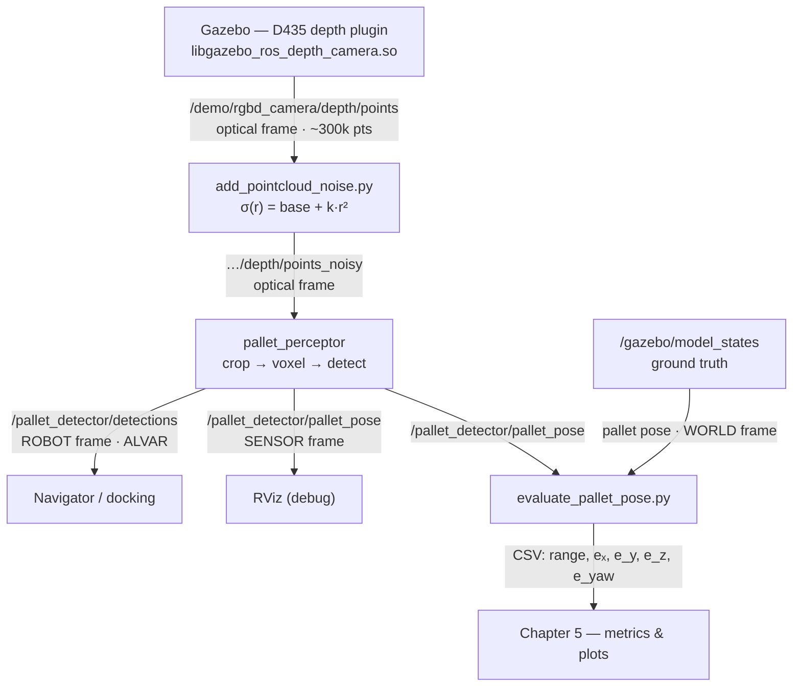
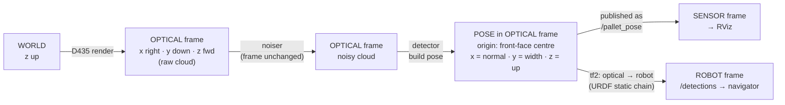

# 4. Simulation Framework

The detector developed in Chapter 3 is purely geometric and consumes a single point cloud per frame. To exercise it without a physical robot, a complete Gazebo simulation reproduces the three things the algorithm actually depends on: the **scene geometry** (an EUR/EPAL pallet on a floor, surrounded by clutter and deliberate decoys), the **sensor** (an Intel RealSense D435-style RGB-D camera with the correct field of view, resolution, and range), and the **depth-error behaviour** of that sensor. The first two are standard Gazebo modelling; the third is the chapter's principal contribution, because the default simulator produces depth that is far cleaner than any real stereo camera, and a detector validated only on clean depth proves nothing about field performance.

This chapter follows the data as it flows through the system. Section 4.1 builds the world and the robot. Section 4.2 specifies the camera and the coordinate frames it introduces. Section 4.3 replaces the simulator's inadequate built-in noise with a range-dependent injector and justifies every constant in it. Section 4.4 traces the cloud through the pipeline, fixing the frame and sign convention at each hop, so that a single diagram answers the question "where, and in what convention, is the pallet pose published?". Section 4.5 closes the loop with ground truth, reconciling Gazebo's pallet frame with the detector's published convention so that per-frame error can be measured. The experimental procedure that uses this harness, and the metrics it computes, are deferred to Chapter 5.

---

## 4.1. Simulation Environment

### 4.1.1. Gazebo World and Scene Layout

The entire scene is described by one SDF file, `site-models/worlds/WalledCubes.world`, which pulls in three external models by reference and inlines two more directly. Table 4.1 lists what each object is and why it is present.

**Table 4.1 — Objects in `WalledCubes.world`.**

| Object | Defined in | What it is and why |
|---|---|---|
| Pallet (target) | `model://pallet_realistic` (mesh) | Realistic EUR/EPAL pallet, 1.22 × 0.80 × 0.145 m, placed at world `(2.0, 0, 0)` — the detection target. |
| Carton box on pallet | inlined as `carton_box_on_pallet` | 0.96 × 0.56 × 0.50 m box centred on the pallet top deck. Verifies that cargo on top does not bias the pose, since the detector keys on the front face and stringers, not the top. |
| Solid pallet-sized decoy | inlined as `solid_box_pallet_size` | 1.2 × 0.8 × 0.15 m solid box, 1 m to the side. A negative test: it passes the size gate but, having no fork-pocket gaps, must be rejected by template matching. |
| Walls of cubes | `model://walled_cubes` | Surrounding clutter (cubes, a cylindrical column, an enclosing wall ring, a table and reflectors) that produces additional Euclidean clusters the detector must discard. |
| Ground / sun | Gazebo built-ins | Floor plane and lighting. |

The pallet is placed 2 m directly in front of the robot's spawn point. The carton and the solid decoy are the two cases that most stress the recognition logic: the first checks that a loaded pallet is still detected, and the second checks that a confuser of the right *size* but wrong *structure* is rejected. The clutter ring ensures the front-end clustering stage is never operating on a trivially clean scene.

### 4.1.2. The EUR/EPAL Pallet Model

`pallet_realistic/model.sdf` separates appearance from physics, which matters for a depth sensor. The **visual** is a triangle mesh (`meshes/pallet.dae`) so that the rendered depth image shows the true fork-pocket geometry — the top deck and the three vertical stringers separated by the two fork openings — exactly the structure the front-face template in Chapter 3 is built to match. The **collision** is a simplified set of four boxes (one top-deck slab plus three stringer blocks at `y = −0.35, 0, +0.35`), which keeps contact dynamics cheap without affecting the cloud, because the point cloud is generated from the visual mesh, not the collision shapes.

The nominal dimensions (1.22 m long, 0.80 m wide, 0.145 m tall) are the standard EUR/EPAL footprint and are the same numbers the detector's template generator reads from its configuration, so the simulated target and the matcher's expectation are guaranteed consistent.

### 4.1.3. Robot Platform and Sensor Mounting

The detector is deployed on **Duna**, the company's mobile-robot platform, defined by the xacro chain in `duna/urdf/model.xacro`. The robot is spawned at the world origin; with the pallet at `(2.0, 0, 0)`, the camera looks down its forward axis at a target 2 m away, comfortably inside the ≤ 1.5 m–oriented operating envelope once the robot has approached.

The camera is rigidly mounted on the platform through a short, fully fixed kinematic chain:

```
platform ──► camera_front ──► rgbd_camera_link ──► rgbd_camera_optical_frame
 (body)        (housing)        (D435 body)          (depth optical frame)
```

The `platform → camera_front` joint places the housing at `[½·platform_length + 0.02, 0, 0.22]` (forward edge of the platform, 0.22 m up). The D435 body, `rgbd_camera_link`, sits 0.05 m above that, and the depth optical frame is rotated from the body by `rpy = (−π/2, 0, −π/2)`. That rotation is the standard ROS conversion from a body frame (x forward) to an optical frame (z forward), and it is the single most important transform in the system because every point the detector ever sees is expressed in `rgbd_camera_optical_frame`. The colour optical frame is identical but shifted −15 mm in *y*, modelling the physical lateral offset between the D435's depth and colour sensors.

> **Note on rigs.** Earlier development used a simplified static *camera stand* (`base_link → stand_link → rgbd_camera_link`) rather than the full robot, which is why some debug tooling refers to `stand_link` and `publish_camera_tf.py`. The deployed system replaces the stand with the Duna platform; the optical-frame conventions and all published topics are identical between the two, and only the intermediate link names and the robot-frame label differ (`base_link` on the stand, `platform` on Duna).

---

## 4.2. D435 Camera Modelling

### 4.2.1. Depth and RGB Sensor Configuration

The simulated camera reproduces the Intel RealSense D435 through two Gazebo sensors attached to `rgbd_camera_link` in `duna/urdf/gazebo/model.gazebo`. The depth sensor drives the pipeline; the colour sensor is modelled for completeness and parity with the real device. Table 4.2 lists the configured values verbatim.

**Table 4.2 — Simulated D435 sensor parameters.**

| Parameter | Depth sensor | Colour sensor |
|---|---|---|
| Horizontal FOV | 1.518 rad ≈ 87° | 1.211 rad ≈ 69.4° |
| Resolution | 1280 × 720 | 1920 × 1080 |
| Clip range | 0.105 – 10.0 m | 0.105 – 10.0 m |
| Update rate | 30 Hz | 30 Hz |
| Output frame | `rgbd_camera_optical_frame` | `rgbd_camera_color_optical_frame` |
| Lateral offset | — | 15 mm (−y from depth) |
| Gazebo plugin | `libgazebo_ros_depth_camera.so` | `libgazebo_ros_camera.so` |

These match the real D435f: an 87° × 58° depth field of view, a 69° horizontal colour field of view, and the ~50 mm-class stereo module whose colour-to-depth lateral offset is captured by the 15 mm frame shift. The depth plugin publishes the organised point cloud on `/demo/rgbd_camera/depth/points` with a near cutoff of 0.105 m and a far cutoff of 10 m (`pointCloudCutoff` / `pointCloudCutoffMax`), so points outside the device's valid range are discarded at the source rather than appearing as spurious returns.

### 4.2.2. Coordinate Frames and the Camera TF Chain

Three frame *types* appear in the system, and keeping them distinct is essential for interpreting every later pose. They are summarised in Table 4.3.

**Table 4.3 — Coordinate frames.**

| Frame | Axes | Origin / source |
|---|---|---|
| `world` | x, y horizontal; **z up** | Gazebo; brought into ROS as the fixed frame. |
| `base` / `platform` (robot body) | **x forward, y left, z up** (ROS REP-103) | URDF root, published by `robot_state_publisher`. |
| `camera_front`, `rgbd_camera_link` | same orientation as the body, translated | URDF chain. |
| `rgbd_camera_optical_frame` | **x right, y down, z forward** (REP-103 optical) | the `(−π/2, 0, −π/2)` joint off `rgbd_camera_link`. |

Two conventions coexist: REP-103 *body* axes (x forward, z up) for everything mechanical, and REP-103 *optical* axes (z forward, y down) for the image and the cloud. The detector operates entirely in the optical frame, which is why its internal "gravity is +y" assumption (used by the ground-band crop) is correct: in the optical frame the floor really is in the +y direction. The launch file also publishes a static `world → base` transform; in the Duna deployment this bridge is an identity placeholder, a fact that becomes important for ground-truth evaluation in Section 4.5.

---

## 4.3. Depth Noise Modelling

A geometric detector lives or dies on the quality of its point cloud, so the realism of the simulated depth dominates whether results transfer to hardware. This section explains why the simulator's two readily available noise sources are both inadequate, then specifies the injector that replaces them and the physical reasoning behind its two constants. It ends by stating plainly what the model still does not capture.

### 4.3.1. Limitations of the Built-in Gazebo Depth Noise

The depth sensor's SDF carries a `<noise>` block — additive Gaussian, mean 0, standard deviation 0.01 m. This is the simulator's native noise model, and it is wrong for a stereo depth camera in two ways. First, it is **applied per pixel on the rendered image with a fixed standard deviation**, independent of how far away the surface is. A real stereo camera's depth error grows with distance (derived below), so a flat 1 cm is simultaneously too pessimistic at 0.3 m and far too optimistic at 5 m. Second, it perturbs image intensity rather than depth *along the viewing ray*, so it does not reproduce the way real range error displaces a point outward or inward from the sensor. The result is a cloud whose error profile bears no resemblance to a D435's, regardless of the standard deviation chosen.

### 4.3.2. Rejection of an Off-the-Shelf RealSense Plugin

The obvious alternative is a dedicated RealSense plugin. The `pal-robotics/realsense_gazebo_plugin` (melodic-devel branch) was investigated for exactly this purpose: it compiled cleanly on Noetic with Gazebo 11, and its source was read in full. The finding was that `gazebo_ros_realsense.cpp::FillPointCloudHelper` copies Gazebo's raw depth straight into the cloud — the *same* logic as `libgazebo_ros_depth_camera.so`, merely repackaged behind four camera streams (colour + two infrared + depth). It models **no** depth-dependent noise, **no** edge artefacts, and **no** infrared-stereo disparity; the IR1/IR2 images render but are never used to compute depth. Its only genuine value is topic-name parity with the real D435 ROS driver, which matters when porting to hardware but contributes nothing to noise realism. The plugin was therefore rejected, and the project keeps a dedicated post-processing injector, which is strictly more realistic for the property that actually matters here.

### 4.3.3. The Range-Dependent Axial Noise Injector

The injector is a small ROS node, `add_pointcloud_noise.py`, inserted between the camera and the detector. It subscribes to the raw cloud and republishes a perturbed copy on `…/depth/points_noisy`. For each point at Euclidean range $r = \lVert \mathbf{p} \rVert$ from the optical origin, it draws a per-point displacement along that point's own ray:

$$\sigma(r) = \sigma_{\text{base}} + k\,r^2, \qquad \delta \sim \mathcal{N}\!\big(0,\sigma(r)^2\big), \qquad \mathbf{p}' = \frac{r+\delta}{r}\,\mathbf{p}.$$

Scaling the position vector by $(r+\delta)/r$ moves the point **radially**, toward or away from the sensor, which is how range error physically manifests. Because the camera faces the pallet roughly along the optical axis, $r \approx z$ for the points of interest, so this radial model is the axial (depth-direction) noise the docstring describes. The quadratic term is not arbitrary: for a stereo camera, depth is recovered by triangulation and the depth uncertainty follows

$$\sigma_z = \frac{z^2}{f\,b}\,\sigma_d,$$

where $f$ is the focal length in pixels, $b$ the stereo baseline, and $\sigma_d$ the sub-pixel disparity-matching error. The $z^2$ dependence is the defining signature of stereo depth noise and the one the built-in model lacks.

### 4.3.4. Parameter Calibration

The launch file sets the two effective constants (overriding the script's own defaults):

- **$\sigma_{\text{base}} = 0.001$ m (1 mm)** — a near-field floor. The $z^2$ term vanishes as $z \to 0$, but a real sensor never reaches zero error; intrinsic-calibration residual and depth quantisation leave a millimetre-scale floor, so noise does not unphysically disappear at close range.
- **$k = 0.0025$ m$^{-1}$** — the stereo coefficient. Substituting the D435's geometry into $\sigma_z = z^2\sigma_d/(f b)$ — baseline $b \approx 50$ mm, and $f = (1280/2)/\tan(87^\circ/2) \approx 674$ px at the configured depth resolution and FOV — gives $f b \approx 33.7$ px·m, so $k = \sigma_d/(fb)$ corresponds to a sub-pixel disparity error of $\sigma_d \approx 0.084$ px, a realistic matching precision for a well-textured target.

Together they keep the modelled error inside the D435 datasheet's published depth accuracy (sub-2 % of range RMS) across the whole operating envelope, as Table 4.4 shows.

**Table 4.4 — Modelled depth standard deviation versus range.**

| Range $r$ | $\sigma(r)$ | as % of range |
|---:|---:|---:|
| 0.5 m | 1.6 mm | 0.32 % |
| 1.0 m | 3.5 mm | 0.35 % |
| 1.5 m | 6.6 mm | 0.44 % |
| 2.0 m | 11.0 mm | 0.55 % |

At the ~1.5 m working distance the per-point standard deviation is about 6.6 mm, small relative to the 0.10 m fork-pocket gap the detector resolves but large enough to perturb the front-face plane fit, which is exactly the regime in which the detector's robustness should be tested.

### 4.3.5. What the Simulation Does Not Model

The injector reproduces the *statistical* range error of a stereo depth camera, but it is deliberately the only effect modelled, and the cloud is therefore cleaner than a real D435's in several respects that should be stated explicitly rather than discovered later:

- **No infrared speckle or projected-pattern dependence.** The D435 projects an IR texture; depth quality depends on how that pattern lands on the surface. This is not simulated.
- **No stereo block-matching artefacts.** Real depth shows edge fattening and "flying pixels" at depth discontinuities (e.g. the pallet's silhouette against the floor); the injected noise is smooth and edge-agnostic.
- **No dropouts on difficult surfaces.** Low-texture, specular, dark, or transparent materials cause stereo matching to fail, leaving holes. The simulated cloud is dense everywhere the geometry is visible.
- **No multi-path, rolling-shutter, or exposure / IR-illuminator effects.**
- **The noise is white.** Each point is perturbed independently each frame ($\mathcal{N}$, zero-mean, i.i.d.), whereas real depth error is spatially structured and temporally correlated.

The practical consequence is that the results in Chapter 5 characterise the detector against realistic *range error*, not against the full failure modes of a physical sensor. Closing the remaining gap requires recorded D435 data on real pallets, not a different simulation plugin — which is why hardware bag collection is identified as the principal item of future work.

---

## 4.4. Data Flow and Sign Conventions

With the world, the camera, and the noise defined, the remaining question is integration: which node produces which topic, in which frame, and under which convention. This section answers it with two diagrams and two tables, so the rest of the system can be read without tracing the launch file by hand.

### 4.4.1. End-to-End Topic Graph



**Figure 4.1 — Topic and data-flow graph.** Gazebo renders the raw cloud; the noiser perturbs it in place; the perceptor produces two pose topics from the same internal estimate — one in the sensor frame for visualisation, one transformed into the robot frame for the navigator — and the evaluator compares the sensor-frame pose against Gazebo ground truth.

### 4.4.2. The Convention Chain: From Optical Frame to Navigator

The pallet pose is published on **two** topics that carry the *same* orientation convention but live in *different* frames, and conflating them is the easiest mistake to make:

- `/pallet_detector/pallet_pose` (`PoseStamped`) is in the **sensor (optical) frame** and exists for RViz.
- `/pallet_detector/detections` (`target_detector/Detections`, typed `ALVAR`) is in the **robot frame** (`platform` on Duna, `base_link` on the stand) and is what the navigator consumes.

The published object convention itself, set in `pallet_detector.cpp`, places the pose origin at the **centre of the pallet's front face** (not its bounding-box centroid) with local axes **x = outward face normal** (the approach direction, pointing back toward the camera), **y = lateral face width**, **z = up**. The origin choice serves the consumer directly: docking and pickup operate on the approach face, which is the only surface reliably visible from the front and the only one invariant to cargo loaded on top.

> This is the convention adopted after the revision of 2026-05-22; it supersedes an earlier ordering (x = width, y = up, z = approach). Any description in Chapter 3 that still states the older axis assignment should be aligned with the convention given here.

Figure 4.2 traces the cloud from the world frame to both output frames, fixing the convention at each hop.



**Figure 4.2 — The convention chain.** A point begins in the world, is rendered into the optical frame, is perturbed there without changing frame, and becomes a pose whose origin and axes follow the front-face / ALVAR convention. That single pose is then emitted unchanged for visualisation (sensor frame) and, via the static URDF transform `T_{sensor→robot}` applied by `tf2::doTransform`, in the robot frame for the navigator. Table 4.5 states the same chain stage by stage.

**Table 4.5 — Frame and convention at each pipeline stage.**

| Stage | Output | Frame | Convention |
|---|---|---|---|
| 1. Render | `depth/points` | optical | REP-103 optical (x right, y down, z fwd) |
| 2. Noise | `depth/points_noisy` | optical | unchanged |
| 3. Crop + voxel + detect | (internal) | optical | gravity = +y (down) |
| 4. Pose build | `T_object_in_sensor` | optical | origin = front-face centre; x = normal, y = width, z = up |
| 5. `pallet_pose` | `PoseStamped` | sensor (optical) | same as stage 4, for RViz |
| 6. `detections` | `Detections` (ALVAR) | robot (`platform`) | same axes, transformed into robot frame |

### 4.4.3. Per-Stage Debug Clouds

To make each processing stage observable, the perceptor republishes the cloud at four points along the pipeline, and `pallet_detector_2.rviz` loads them as separate displays. They are summarised in Table 4.6; "subscriber-gated" means the cloud is only serialised when something is actually listening (a cost saving), while "vizbose" topics are emitted only when debug visualisation is enabled.

**Table 4.6 — Debug point-cloud topics (all in `rgbd_camera_optical_frame`).**

| # | Topic | Stage | Gating | RViz status |
|---|---|---|---|---|
| 1 | `/demo/rgbd_camera/depth/points` | Gazebo raw | — | loaded, disabled |
| 2 | `/demo/rgbd_camera/depth/points_noisy` | after noise injection | — | loaded, disabled |
| 3 | `/pallet_detector/cloud_no_plane` | Y-band crop (not downsampled) | subscriber-gated | loaded, enabled (cyan) |
| 4 | `/pallet_detector/downsampled_cloud` | voxel downsample (2 cm leaf) | subscriber-gated | loaded, enabled (intensity rainbow) |
| 5 | `/pallet_detector/cloud_out` | matched points of best cluster | vizbose | loaded, disabled (green) |
| 6 | `/pallet_detector/cloud_ransac_inliers` | front-face plane inliers | vizbose | **not yet in the RViz config — needs adding** |

The non-cloud debug outputs complete the picture (Table 4.7): the OBB markers and the sensor-frame pose render the estimate visually, while `detections` is the robot-frame message the navigator reads and is not itself a visualisation. The loaded TF tree confirms the full chain `world → base → … → rgbd_camera_link → optical frames` resolves, which is what lets RViz display every optical-frame cloud against the fixed `world` frame.

**Table 4.7 — Non-cloud debug outputs.**

| Topic | Type | Frame | RViz status |
|---|---|---|---|
| `/pallet_detector/visuals` | `Marker` (green = matched-points OBB, red = RANSAC-inlier OBB) | optical | loaded, disabled |
| `/pallet_detector/pallet_pose` | `PoseStamped` (best pose) | optical | loaded, disabled |
| `/pallet_detector/detections` | `Detections` (pose transformed to robot frame) | robot | not a viz display |
| `/demo/rgbd_camera/depth/image_raw` | `Image` (depth) | optical | loaded, disabled |
| TF tree | — | `world → … → optical` | loaded, enabled |

---

## 4.5. Ground-Truth Acquisition and Pose Evaluation

The simulation's decisive advantage over hardware is that the true pallet pose is known exactly. The node `evaluate_pallet_pose.py` exploits this: it listens to the detector's output and to Gazebo's ground truth, brings both into a common frame and a common convention, and records the per-frame error. This section describes how ground truth is obtained and, critically, how the two different pose conventions are reconciled so that the comparison is meaningful.

### 4.5.1. Gazebo Model States and the World Composition

Ground truth comes from the `/gazebo/model_states` topic, which reports the world pose of every model — including the `pallet` and the `duna` robot — at simulation rate. The detection arrives on `/pallet_detector/pallet_pose` in the optical frame, so the two must be brought together. The natural route would be the TF tree, but the launch file's `world → base` transform is a static identity placeholder, so the optical→world chain cannot be trusted directly. The evaluator therefore composes the transform itself:

1. Transform the detection from the optical frame into the robot frame using the trustworthy URDF static chain (`tf2`).
2. Compose robot→world using the robot's *own* Gazebo pose, taken from `/gazebo/model_states`, treating the robot as a planar (yaw-only) body.

Composing through the robot's live Gazebo pose, rather than a fixed transform, is what allows the robot to **move**: the evaluator stays correct as the robot drives toward or rotates relative to the pallet, and it records the camera-to-face **range** on every frame. That per-frame, range-aware design is precisely what enables the operating-envelope analysis in Chapter 5, where accuracy is studied as a function of distance and yaw rather than at a single fixed pose.

### 4.5.2. Pose Convention Reconciliation

Gazebo and the detector describe the same physical pallet in two different conventions, and the error would be meaningless without aligning them. Two corrections are applied to the ground-truth pose before comparison:

- **Origin shift.** Gazebo reports the pallet's geometric centre; the detector reports the centre of the front face. The evaluator slides the ground-truth origin forward along the pallet's local −x axis by half the pallet length ($0.61$ m $= 1.22/2$):
$$x_{\text{face}} = x_{\text{gt}} - \tfrac{L}{2}\cos\psi_{\text{gt}}, \qquad y_{\text{face}} = y_{\text{gt}} - \tfrac{L}{2}\sin\psi_{\text{gt}}.$$
- **Axis relabelling.** Gazebo's pallet frame has x along the long axis (pointing back into the pallet), y along the width, z up. The detector's convention has x along the outward face normal (toward the camera). The two differ by a $180°$ rotation about the vertical axis, applied as the fixed quaternion $R_z(180°)$ before the yaw error is computed.

After both corrections, the ground-truth and detected poses share the same origin definition (front-face centre) and the same axis convention (x = outward normal, y = width, z = up), so the residual is a true pose error. The per-frame record is therefore: timestamp, camera-to-face range, the three translation errors $(e_x, e_y, e_z)$, and the yaw error $e_\psi$. (The evaluator's convention quaternion was itself updated on 2026-05-23 to match the detector revision of 2026-05-22, keeping the two ends of the comparison consistent.)

### 4.5.3. Evaluator Outputs and Link to the Results Chapter

On every matched frame the evaluator logs the tuple above; on shutdown it prints the sample count together with the mean, standard deviation, and RMSE of each error component, and optionally writes the full per-frame series to CSV. This harness is the measurement instrument; it does not itself define *what* is measured or *under what experimental protocol*. Those belong to the Results chapter, which (i) defines the metrics — translation RMSE, yaw RMSE, and detection rate, together with the failure criterion on large yaw error — and (ii) specifies the experimental procedure, namely the trajectory along which the robot approaches the pallet so that error can be plotted against range and yaw to delimit the envelope within which the detector returns accurate poses to the navigator.
